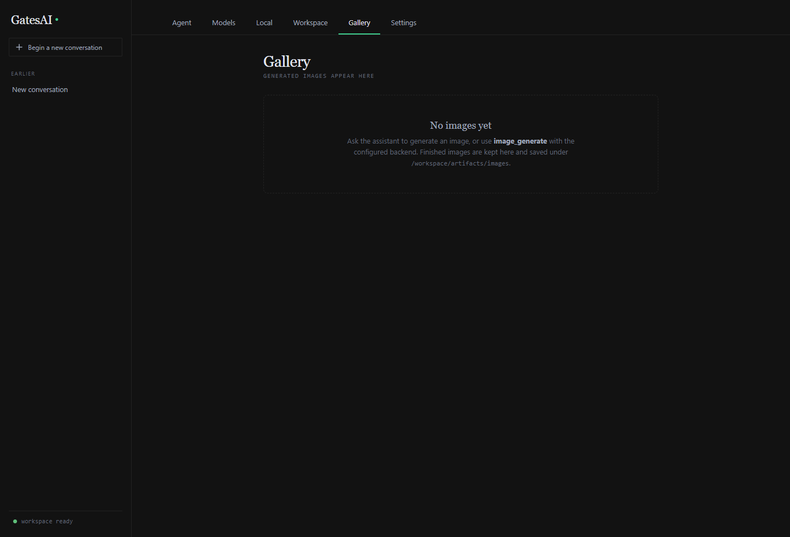
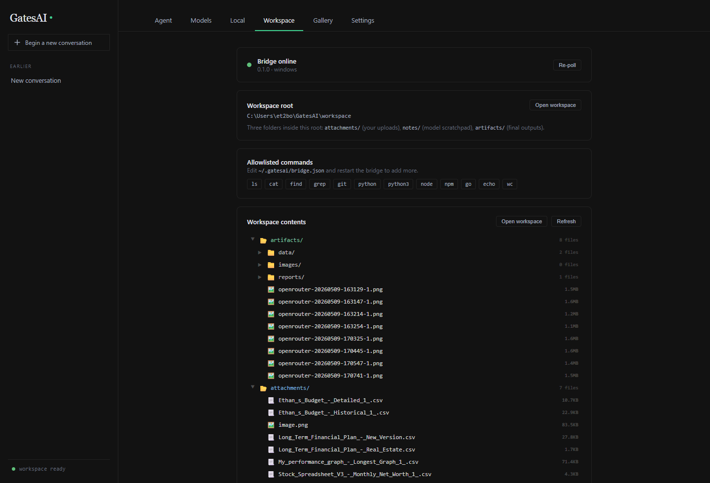

# GatesAI Chat

[](https://calculator5329.github.io/GatesAI-Chat/)
[](https://react.dev/)
[](https://www.typescriptlang.org/)
[](https://tauri.app/)
[](https://vite.dev/)
[](https://mobx.js.org/)
[](#quality-gates)

> **Live demo:** [calculator5329.github.io/GatesAI-Chat](https://calculator5329.github.io/GatesAI-Chat/)
> — the browser **Web Lite** build. The full UI is interactive; chatting uses your own OpenRouter
> API key (entered in the Models menu and kept only in your browser). Desktop features that need the
> local bridge (files, shell, image generation) are intentionally disabled in this mode.

> **In three sentences:** GatesAI Chat is a local-first desktop AI workspace (React + Tauri)
> where you bring your own models — OpenRouter in the cloud or Ollama on your own machine — and
> chat in a calm, editorial interface. A sandboxed companion "bridge" process lets the assistant
> actually *do* things locally: read and write files in a jailed workspace, run allowlisted
> shell / Python / SQLite / git commands, search the web, and generate images through ComfyUI.
> It's built on a strict UI → store → service architecture (MobX state, stateless services) that
> ESLint enforces automatically, so the patterns stay consistent and both humans and AI agents
> can keep extending it safely.

A local-first AI chat workspace for Windows (with a browser "Web Lite" mode), built as a
React 19 + TypeScript single-page app wrapped in a Tauri 2 desktop shell. It pairs a
provider-agnostic LLM client with a sandboxed local **bridge** process so the assistant can
read and write real files, run allowlisted shell commands, query data, connect to MCP tool
servers, and generate images — all on your own machine.

The core promises: **fast** (instant-feeling streaming, no jank), **simple** (download the
exe and chat — no account, no setup), **your models** (any OpenRouter model or any local
Ollama model, switchable mid-conversation, fully offline-capable with local models), and
**your data** (everything stays on your device — API keys in the OS credential store,
history in local storage with an IndexedDB archive, files in a workspace folder you own).

It is designed to feel like a quiet, editorial writing room and developer console rather than a
SaaS dashboard: dark theme, serif chat prose, compact operational controls, and an ambient
activity timeline for everything the model does.

## Download

Prebuilt desktop installers are published on the
[**latest release**](https://github.com/Calculator5329/GatesAI-Chat/releases/latest). The desktop
app bundles the local bridge, so files, shell tools, and image generation work out of the box.

| Platform | Download | Runs on |
| --- | --- | --- |
| **Windows** | [`GatesAI-Chat-Setup-x64.exe`](https://github.com/Calculator5329/GatesAI-Chat/releases/latest/download/GatesAI-Chat-Setup-x64.exe) | Windows 10/11, 64-bit (runs on ARM via emulation) |
| **Linux** | [`GatesAI-Chat-x86_64.AppImage`](https://github.com/Calculator5329/GatesAI-Chat/releases/latest/download/GatesAI-Chat-x86_64.AppImage) | Linux x86_64 |
| **macOS / others** | [Build from source](#getting-started-development) | — (no prebuilt binary yet) |

Prefer to try before installing? The browser **[Web Lite demo](https://calculator5329.github.io/GatesAI-Chat/)**
runs the full UI with your own OpenRouter key (desktop-only local features are disabled there, and
it points you to the matching download above).

---

## Highlights

- **Bring-your-own-model chat** — OpenRouter cloud catalog (live `/api/v1/models` refresh,
  pricing, favorites) plus local **Ollama** models, behind one streaming `LlmProvider` contract.
- **Threaded conversations** with per-thread streaming, interrupt-and-resend, branching,
  regenerate-in-place, soft-delete with undo, sidebar search, and AI auto-naming.
- **Durable autosave** — every conversation is throttled-saved to `localStorage`, survives quota
  limits via emergency compaction, and (on desktop) mirrors to a readable
  `/workspace/chat-history` HTML/Markdown library.
- **Agent tooling** — a registry of browser-side tools: `memory`, `notes`, `thread`,
  `chat_history`, `web_search` (Brave), `fs`, `terminal`, `inspect_file`, `python_inline`,
  `sqlite_query`, `git`, `image_generate`, `describe_image`, `artifact`, `workspace`,
  `source_workspace`, `source_build`, `query_script`, `time`, `logs`, and more. Adding a tool is one file
  plus one registry line.
- **Self-diagnosis** — central `services/diagnostics/logger` (ring buffer + console +
  bridge JSONL) and a `logs` tool so the assistant can read recent app logs.
- **Companion bridge** (`../gatesai-bridge`, Go) — owns a `~/GatesAI/workspace/` folder behind a
  path jail and command allowlist, exposed over a single loopback WebSocket.
- **Local image generation** — background image-job queue driving ComfyUI (FLUX.2 Klein / SDXL
  Lightning) with live progress, a Gallery, and a lightbox.
- **Memory** — durable user facts plus lazy cross-thread summaries composed into the system
  prompt (no embeddings/RAG — the prompt is the delivery mechanism).
- **Multimodal input** — drop images into the composer; vision-capable models receive the pixels.

## Screenshots

| Chat | Model picker |
| --- | --- |
|  |  |

| Gallery | Workspace |
| --- | --- |
|  |  |

| Agent memory | Provider catalog |
| --- | --- |
|  |  |

## Architecture

GatesAI Chat follows a strict, one-way layered architecture enforced by ESLint import rules:

```
UI (components/, app/)
      ▼
Stores (MobX object models)
      ▼
Services (persistence, llm/, tools/, image/, bridge, router)
      ▼
Core (types, theme, models, providers, runtime, llm contract)
```

| Layer | Responsibility | May import |
| --- | --- | --- |
| `core/` | Pure data, types, runtime detection | nothing else |
| `services/` | Stateless I/O: APIs, persistence, integrations | `core/` |
| `stores/` | Observable state + business logic (MobX) | `core/`, `services/` |
| `components/ui/` | Feature-agnostic primitives | `core/` |
| `components/<feature>/` | Feature UI (observers) | `core/`, `stores/`, `components/ui/`, `components/media/` |
| `app/` | Composition root | everything |

Deeper design notes live in [`docs/architecture.md`](docs/architecture.md) and
[`docs/tech_spec.md`](docs/tech_spec.md). Per-session history is in
[`docs/changelog.md`](docs/changelog.md).

## Tech stack

React 19 · TypeScript 6 · Vite 8 · MobX 6 · Tauri 2 (Rust host) · Go bridge ·
react-markdown / KaTeX / Mermaid / highlight.js · Vitest + Playwright · ESLint 9.

## Getting started (development)

Requirements:

- Node.js / npm for the chat app
- Rust + Tauri prerequisites for desktop builds
- Either Go 1.24+ or a prebuilt bridge binary at `..\gatesai-bridge\bin\gatesai-bridge.exe`

```powershell
npm install        # install dependencies
npm run dev        # Vite dev server (Web Lite mode in the browser)
npm run tauri:dev  # desktop app against the dev server
```

Run the bridge from source during development:

```powershell
cd ..\gatesai-bridge
go run ./cmd/gatesai-bridge
```

## Quality gates

```powershell
npm run typecheck  # tsc project build + test project typecheck
npm run lint       # ESLint (includes the architecture-boundary import rules)
npm run test       # Vitest unit/component suite (683 tests)
npm run test:watch # Vitest in watch mode
npm run test:models # Live OpenRouter compatibility (needs API key)
npm run ci         # all three, in order
npm run test:e2e   # Playwright UI suite (19 e2e tests; desktop-mocked + web-lite)
```

The Playwright suite runs the real app in a browser two ways — a faked-bridge
desktop build (attachments, image jobs, gallery, settings) and the Web Lite
build (degraded-state assertions) — with the OpenRouter stream mocked. See
[`docs/tech_spec.md`](docs/tech_spec.md#testing) for the mock strategy.

## Building the desktop app

```powershell
npm run tauri build   # produces the NSIS installer; bundles the Go bridge automatically
```

### Linux AppImage builds

Tauri sidecars must be named with the target triple
(`src-tauri/binaries/gatesai-bridge-x86_64-unknown-linux-gnu`). From a Linux host with the
companion bridge repo checked out next to this one:

```bash
npm ci
bash scripts/prepare-linux-sidecar.sh        # or: GATESAI_BRIDGE_BIN=/path/to/bridge bash scripts/prepare-linux-sidecar.sh
npx tauri build --bundles appimage
```

The GitHub Actions workflow builds a real Linux bridge when `GATESAI_BRIDGE_REPOSITORY` is
configured. For end-user Arch Linux steps, open `docs/arch-linux-appimage-install.html`.

## Repository layout

```
src/
  app/          composition root
  components/   ui/ (primitives) · editorial/ (chat) · menu/ (settings) · media/ (shared image UI)
  stores/       MobX stores (Chat, Provider, Bridge, ImageJob, ... )
  services/     llm/, tools/, image/, bridge, storage, diagnostics/, local/, compat/, search/, router
  core/         types, models, providers, theme, runtime
tests/          Vitest suite (kept out of the app build)
docs/           handbook, architecture, tech spec, roadmap, changelog, audits, plans, notes
```
