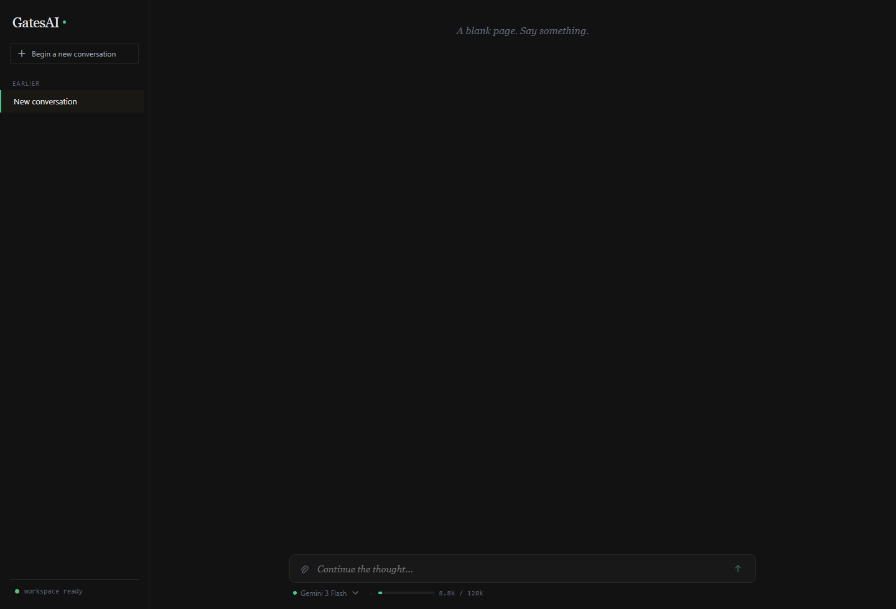
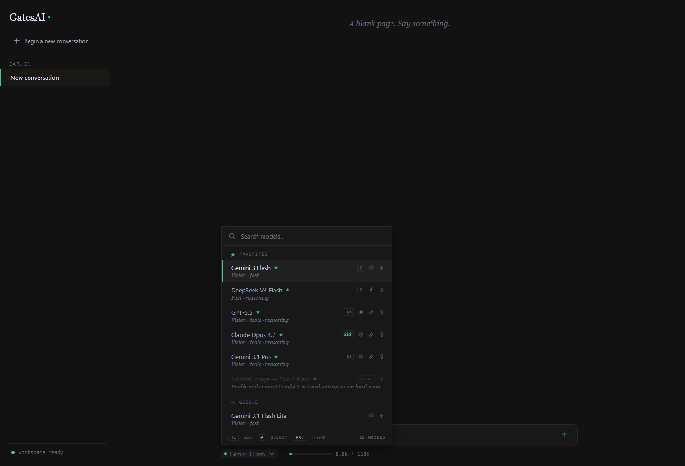
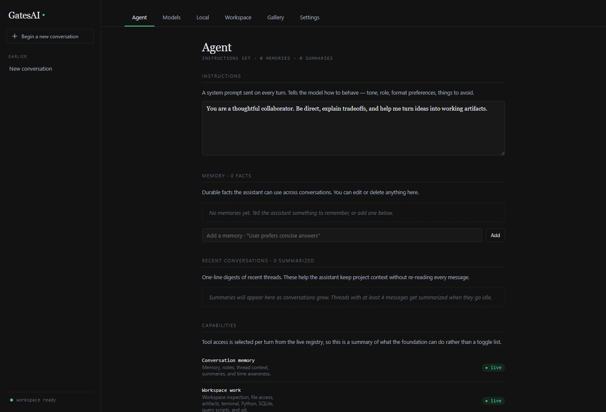
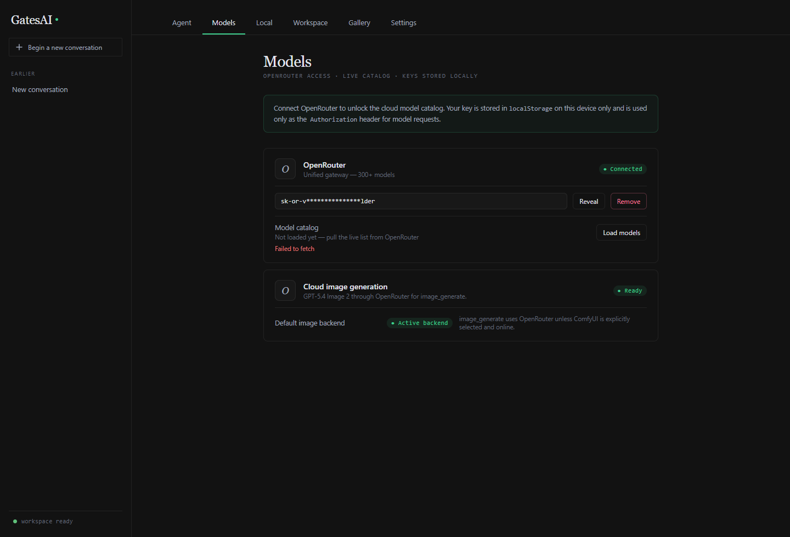

# GatesAI Chat

[](https://github.com/Calculator5329/GatesAI-Chat/actions/workflows/ci.yml)
[](https://calculator5329.github.io/GatesAI-Chat/)
[](https://react.dev/)
[](https://www.typescriptlang.org/)
[](https://tauri.app/)
[](https://vite.dev/)
[](https://mobx.js.org/)
[](#quality-gates)

<!--
  Demo GIF placeholder. The recording needs a human on a desktop machine —
  follow the exact click-by-click capture script in scripts/demo-capture.md
  (spawn a background agent → Task center → rendered HTML artifact), convert
  to docs/media/demo.gif under 10 MB, and commit it at that path.
-->


> **Live demo:** [calculator5329.github.io/GatesAI-Chat](https://calculator5329.github.io/GatesAI-Chat/)
> — the browser **Web Lite** build. The full UI is interactive; chatting uses your own OpenRouter
> API key (entered in the Models menu and kept only in your browser). Desktop features that need the
> local bridge (files, shell, image generation) are intentionally disabled in this mode.

> **In three sentences:** GatesAI Chat is a local-first desktop AI workspace (React + Tauri)
> where you bring your own models — OpenRouter in the cloud or Ollama on your own machine — and
> chat in a calm, editorial interface. A sandboxed companion "bridge" process lets the assistant
> actually *do* things locally: read and write files in a jailed workspace, run allowlisted
> shell / Python / SQLite / git commands, search the web, and generate images through ComfyUI.
> It's built on a strict UI → store → service architecture (MobX state, stateless services) that
> ESLint enforces automatically, so the patterns stay consistent and both humans and AI agents
> can keep extending it safely.

A local-first AI chat workspace for Windows and Linux (with a browser "Web Lite" mode), built as a
React 19 + TypeScript single-page app wrapped in a Tauri 2 desktop shell. It pairs a
provider-agnostic LLM client with a sandboxed local **bridge** process so the assistant can
read and write real files, run allowlisted shell commands, query data, and generate images,
while app state and workspace data stay on your machine.

The core promises: **fast** (instant-feeling streaming, no jank), **simple** (one desktop
installer and no GatesAI account), **your models** (OpenRouter or local Ollama, switchable
mid-conversation and offline-capable with local
models), and **your data** (app state stays on your device; requests go only to the model
provider you select; desktop API keys use the OS credential store; files live in a workspace
folder you own).

It is designed to feel like a quiet, editorial writing room and developer console rather than a
SaaS dashboard: paper-like dark and light themes, serif chat prose, compact operational controls,
and an ambient activity timeline for everything the model does.

## Download

Prebuilt desktop installers are published on the
[**latest release**](https://github.com/Calculator5329/GatesAI-Chat-releases/releases/latest). The desktop
app bundles the local bridge, so file and shell tools work out of the box. Image generation uses
OpenRouter or a configured local ComfyUI installation.

| Platform | Download | Runs on |
| --- | --- | --- |
| **Windows** | [`GatesAI-Chat-Setup-x64.exe`](https://github.com/Calculator5329/GatesAI-Chat-releases/releases/latest/download/GatesAI-Chat-Setup-x64.exe) | Windows 10/11, 64-bit (runs on ARM via emulation) |
| **Linux** | [`GatesAI-Chat-x86_64.AppImage`](https://github.com/Calculator5329/GatesAI-Chat-releases/releases/latest/download/GatesAI-Chat-x86_64.AppImage) | Linux x86_64 |
| **macOS / others** | [Build from source](#getting-started-development) | — (no prebuilt binary yet) |

Prefer to try before installing? The browser **[Web Lite demo](https://calculator5329.github.io/GatesAI-Chat/)**
runs the full UI with your own OpenRouter key (desktop-only local features are disabled there, and
it points you to the matching download above).

---

## Highlights

- **Bring-your-own-model chat** — OpenRouter cloud catalog (live `/api/v1/models` refresh,
  pricing, favorites) plus local **Ollama** models, behind one streaming `LlmProvider` contract.
  New chats default to **Nemotron 3 Ultra free** (`nvidia/nemotron-3-ultra-550b-a55b:free` via
  OpenRouter, $0 but free-tier rate-limited); paste your OpenRouter API key under
  **Menu → Models → OpenRouter → Connect** to start chatting.
- **Threaded conversations** with per-thread streaming, interrupt-and-resend, branching,
  regenerate-in-place, soft-delete with undo, sidebar search, and AI auto-naming.
- **Durable autosave** — every conversation is throttled-saved to `localStorage`, survives quota
  limits via emergency compaction, and (on desktop) mirrors to a readable
  `/workspace/chat-history` HTML/Markdown library.
- **Agent tooling** — a built-in registry with `memory`, `recall`, `library`, `notes`,
  `thread`, `chat_history`, `spawn_task`, `web_search` (Brave), `fetch_page`, `fs`,
  `terminal`, `inspect_file`, `python_inline`, `sqlite_query`, `query_script`, `git`,
  `image_generate`, `describe_image`, `artifact`, `workspace`, `time`, and `logs`.
- **Self-diagnosis** — central `services/diagnostics/logger` (ring buffer + console +
  bridge JSONL) and a `logs` tool so the assistant can read recent app logs.
- **Companion bridge** (`../gatesai-bridge`, Go) — owns a `~/GatesAI/workspace/` folder behind a
  path jail and command allowlist, exposed over a single loopback WebSocket.
- **Local image generation** — background image-job queue driving ComfyUI (FLUX.2 Klein / SDXL
  Lightning) with live progress rendered inline in the chat.
- **Memory and semantic recall** — durable user facts and lazy cross-thread summaries, plus
  a local RAG index over chats, notes, facts, and explicitly approved workspace documents
  using Ollama embeddings and IndexedDB vectors. SQLite library sources expose schema only;
  row reads stay bounded and read-only.
  Relevant snippets can be supplied automatically or retrieved with the `recall` tool; answers
  expose their exact source excerpts, and Agent → Memory controls what may be indexed and recalled.
- **Brave web research** — ordinary chat can use compact live-web grounding, while the
  composer’s **Research** action starts a visible background investigation with broader searches,
  source-integrity rules, progress, cancellation, retry, and a linked result thread.
- **Multimodal input** — drop images into the composer; vision-capable models receive the pixels.

## Screenshots

| Chat | Model picker |
| --- | --- |
|  |  |

| Agent memory | Provider catalog |
| --- | --- |
|  |  |

## Architecture

GatesAI Chat follows a strict, one-way layered architecture enforced by ESLint import rules:

```
UI (components/, app/)
      ▼
Stores (MobX object models)
      ▼
Services (persistence, llm/, chat/, tools/, image/, bridge, rag/, router)
      ▼
Core (types, theme, models, providers, runtime, llm contract)
```

| Layer | Responsibility | May import |
| --- | --- | --- |
| `core/` | Pure data, types, runtime detection | nothing else |
| `services/` | Stateless I/O: APIs, persistence, integrations | `core/` |
| `stores/` | Observable state + business logic (MobX) | `core/`, `services/` |
| `components/ui/` | Feature-agnostic primitives | `core/` |
| `components/<feature>/` | Feature UI (observers) | `core/`, `stores/`, `components/ui/`, `components/media/` |
| `app/` | Composition root | everything |

Deeper design notes live in [`docs/architecture.md`](docs/architecture.md) and
[`docs/tech_spec.md`](docs/tech_spec.md). Per-session history is in
[`docs/changelog.md`](docs/changelog.md). See [`CONTRIBUTING.md`](CONTRIBUTING.md) to set up
a development environment and prepare a pull request.

## Tech stack

React 19 · TypeScript 6 · Vite 8 · MobX 6 · Tauri 2 (Rust host) · Go bridge ·
react-markdown / KaTeX / Mermaid / highlight.js · Vitest + Playwright · ESLint 9.

## Getting started (development)

Requirements:

- Node.js 22 / npm for the chat app (the version used by CI)
- Rust + Tauri prerequisites for desktop builds
- Either Go 1.24+ or a prebuilt bridge binary at `..\gatesai-bridge\bin\gatesai-bridge.exe`

```powershell
npm ci             # install the locked dependencies
npm run dev        # Vite dev server (Web Lite mode in the browser)
npm run tauri:dev  # desktop app against the dev server
```

Run the bridge from source during development:

```powershell
cd ..\gatesai-bridge
go run ./cmd/gatesai-bridge
```

## Quality gates

```powershell
npm run test       # Vitest unit/component suite (1,174 tests)
npm run typecheck  # tsc project build + test project typecheck
npm run lint       # ESLint (includes the architecture-boundary import rules)
npm run test:watch # Vitest in watch mode
npm run model-compat:catalog # Free live-catalog policy audit
npm run test:models # Budget-capped live OpenRouter probes (needs API key)
npm run ci         # all three, in order
npm run test:e2e   # Playwright UI suite (28 e2e tests; desktop-mocked + web-lite)
```

The scheduled model runner audits OpenRouter's public catalog daily and runs
the full curated text/tool/continuation smoke weekly when the repository has an
`OPENROUTER_API_KEY` secret. Live runs default to a $2 preflight/runtime cap;
use `--family <id>` with `scripts/model-compat/cli.ts` for a focused rerun.
Reports are written under `artifacts/model-compat/` and uploaded by Actions.

The Playwright suite runs the real app in a browser two ways — a faked-bridge
desktop build (attachments, image jobs, gallery, settings) and the Web Lite
build (degraded-state assertions) — with the OpenRouter stream mocked. See
[`docs/tech_spec.md`](docs/tech_spec.md#testing) for the mock strategy.

### UI review screenshots

Run `npm run screenshots` to capture the key desktop visual states at a fixed
1440×900 viewport. The headless Playwright run starts Vite (or reuses the local
test server outside CI), uses only local fixtures and mocked providers, and
writes PNGs plus a machine-readable manifest to
`screenshots/<git-short-sha>/manifest.json`. The output directory is ignored by
Git so before/after packets can be generated without dirtying the worktree.

## Building the desktop app

```powershell
npm run tauri:build   # produces the NSIS installer from the prepared Go bridge sidecar
```

### Linux AppImage builds

Tauri sidecars must be named with the target triple
(`src-tauri/binaries/gatesai-bridge-x86_64-unknown-linux-gnu`). From a Linux host with the
companion bridge repo checked out next to this one:

```bash
npm ci
bash scripts/prepare-linux-sidecar.sh        # or: GATESAI_BRIDGE_BIN=/path/to/bridge bash scripts/prepare-linux-sidecar.sh
npx tauri build --bundles appimage
```

The GitHub Actions workflow builds a real Linux bridge when `GATESAI_BRIDGE_REPOSITORY` is
configured. For end-user Arch Linux steps, open `docs/arch-linux-appimage-install.html`.

## Repository layout

```
src/
  app/          composition root
  components/   ui/ (primitives) · editorial/ (chat) · menu/ (settings) · media/ (shared image UI)
  stores/       MobX stores (Chat, Provider, Bridge, ImageJob, ... )
  services/     llm/, chat/, tools/, image/, bridge/, rag/, persistence/, storage/, and integrations
  core/         types, models, providers, theme, runtime
tests/          Vitest suite (kept out of the app build)
docs/           handbook, architecture, tech spec, roadmap, changelog, audits, plans
```

## License

Licensed under the [GNU Affero General Public License v3.0](LICENSE). You are free to use,
study, modify, and share this software; if you run a modified version as a network service, the
AGPL requires you to make your source available to its users.
