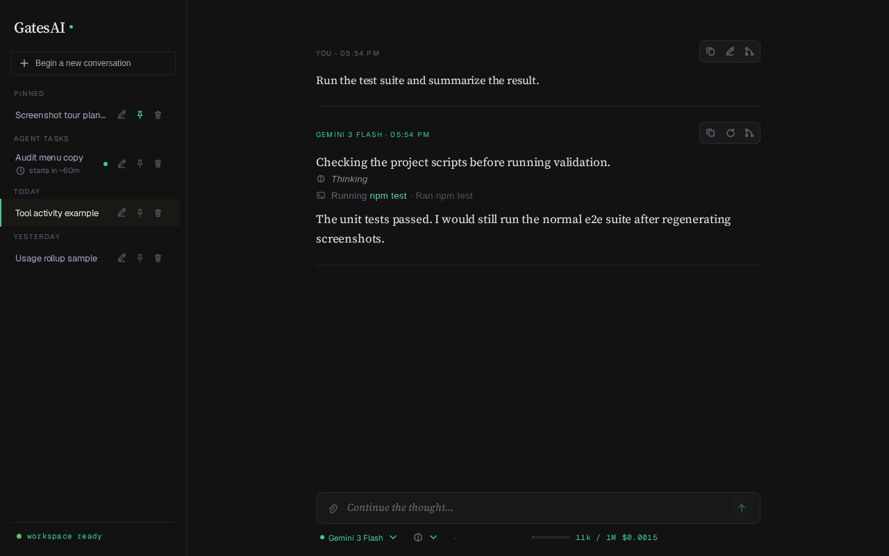
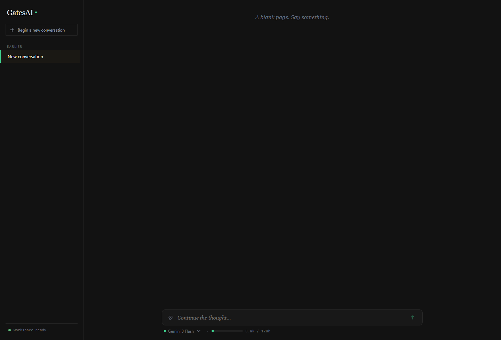
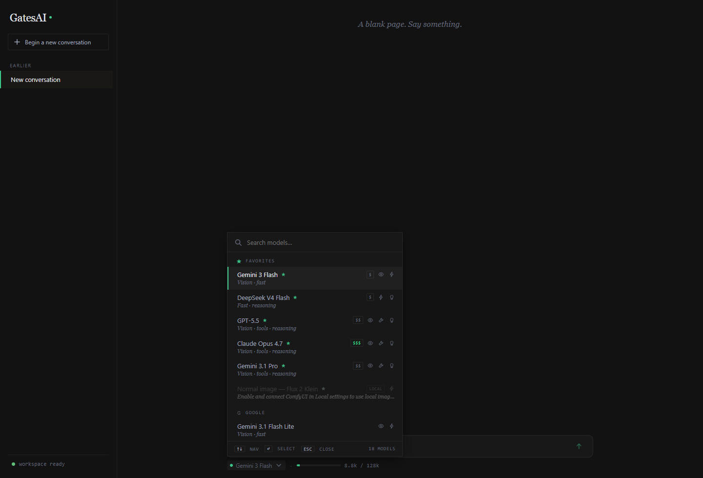
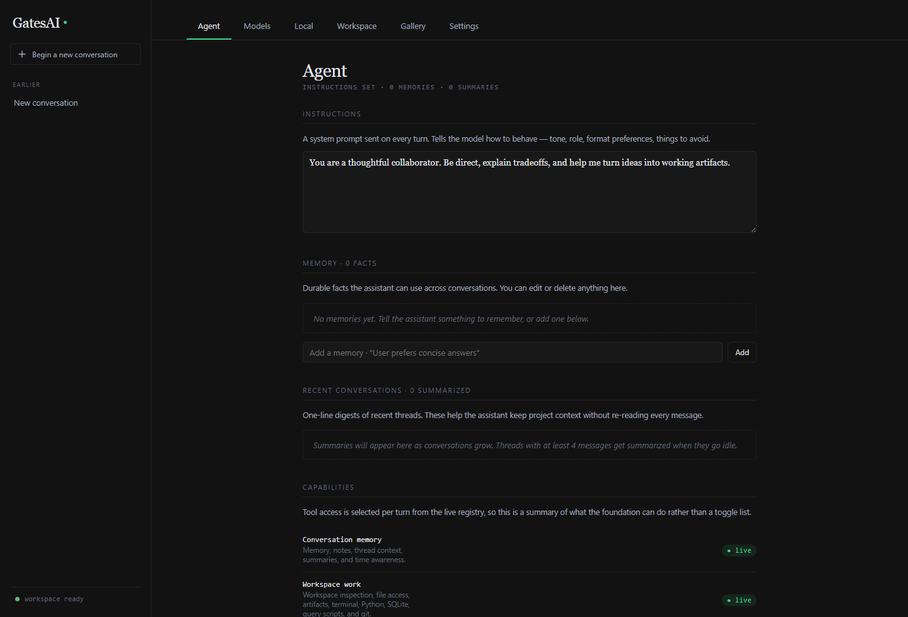
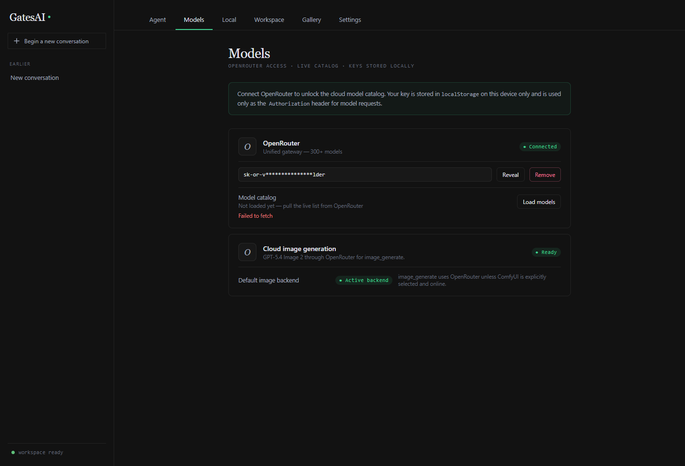

# GatesAI Chat

[](https://github.com/Calculator5329/GatesAI-Chat/actions/workflows/ci.yml)
[](https://gatesai.site/)
[](https://react.dev/)
[](https://www.typescriptlang.org/)
[](https://tauri.app/)
[](https://vite.dev/)
[](https://mobx.js.org/)
[](#quality-gates)



GatesAI Chat is an AI chat app you install on your own machine. You bring the models, either
OpenRouter in the cloud or Ollama running locally, and the conversations, settings, and files stay
on your device. There is no GatesAI account and no subscription in the middle.

The other half of the app is a companion process called the bridge. It gives the assistant a real
workspace folder it can read and write, plus allowlisted shell, Python, SQLite, and git commands,
web search, and image generation through ComfyUI. Everything the bridge does is scoped to a path
jail and a command allowlist, and it shows up in an activity timeline as it happens, so you can see
what the model touched.

It is meant to feel like a quiet writing room rather than a SaaS dashboard: paper-like dark and
light themes, serif chat prose, and operational controls kept small and out of the way.

## Download

Prebuilt desktop installers are on the
[latest release](https://github.com/Calculator5329/GatesAI-Chat-releases/releases/latest). The
desktop app bundles the bridge, so the file and shell tools work without extra setup. Image
generation uses OpenRouter or a local ComfyUI install you configure yourself.

| Platform | Download | Runs on |
| --- | --- | --- |
| Windows | [`GatesAI-Chat-Setup-x64.exe`](https://github.com/Calculator5329/GatesAI-Chat-releases/releases/latest/download/GatesAI-Chat-Setup-x64.exe) | Windows 10/11, 64-bit (runs on ARM via emulation) |
| Linux | [`GatesAI-Chat-x86_64.AppImage`](https://github.com/Calculator5329/GatesAI-Chat-releases/releases/latest/download/GatesAI-Chat-x86_64.AppImage) | Linux x86_64 |
| macOS and others | [Build from source](#running-it-from-source) | No prebuilt binary yet |

## Try it in the browser

[gatesai.site](https://gatesai.site/) runs the browser **Web Lite** build. The full UI is
interactive, and chatting uses your own OpenRouter API key, which you paste into the Models menu and
which never leaves your browser. Desktop features that need the local bridge (files, shell, image
generation) are deliberately disabled there, and the app points you at the matching download above.

## What it does

Chat is threaded, with per-thread streaming, interrupt and resend, branching, regenerate in place,
soft delete with undo, sidebar search, and AI auto-naming of threads. Every conversation is
autosaved to `localStorage` on a throttle, survives quota pressure through emergency compaction,
and on desktop also mirrors into a readable `chat-history` library of HTML and Markdown.

Models come from one streaming `LlmProvider` contract with two implementations behind it: the live
OpenRouter catalog (refreshed from `/api/v1/models`, with pricing and favorites) and local Ollama
models. You can switch mid-conversation. New chats start on Nemotron 3 Ultra free
(`nvidia/nemotron-3-ultra-550b-a55b:free`), which costs nothing but is rate-limited on the free
tier. To use anything else from OpenRouter, connect a key under Menu → Models → OpenRouter.

The assistant's tools live in one registry: `memory`, `recall`, `library`, `notes`, `thread`,
`chat_history`, `spawn_task`, `web_search` (Brave), `fetch_page`, `fs`, `terminal`, `inspect_file`,
`python_inline`, `sqlite_query`, `query_script`, `git`, `image_generate`, `describe_image`,
`artifact`, `workspace`, `time`, and `logs`. The `logs` tool reads the app's own diagnostics ring
buffer, so the assistant can look at recent app logs when something misbehaves.

Memory has two layers. Durable user facts and lazy cross-thread summaries handle the "remember
this" case, and a local RAG index over chats, notes, facts, and explicitly approved workspace
documents handles retrieval, using Ollama embeddings with vectors in IndexedDB. SQLite sources in
the library expose their schema only, and row reads stay bounded and read-only. Answers show the
exact source excerpts they used, and the Agent → Memory panel controls what may be indexed and
recalled at all.

Two more things worth calling out. Ordinary chat can use compact live-web grounding through Brave,
while the composer's Research action starts a visible background investigation with broader
searches, source-integrity rules, progress, cancellation, retry, and a linked result thread. And
you can drop images into the composer, which vision-capable models receive as pixels.

## Screenshots

| Chat | Model picker |
| --- | --- |
|  |  |

| Agent memory | Provider catalog |
| --- | --- |
|  |  |

## Architecture

The app is a React 19 single-page app in a Tauri 2 shell, with a Go bridge process beside it. Inside
the app, imports only ever point one direction, and ESLint enforces that:

```
UI (components/, app/)
      ▼
Stores (MobX object models)
      ▼
Services (persistence, llm/, chat/, tools/, image/, bridge, rag/, router)
      ▼
Core (types, theme, models, providers, runtime, llm contract)
```

| Layer | Responsibility | May import |
| --- | --- | --- |
| `core/` | Pure data, types, runtime detection | nothing else |
| `services/` | Stateless I/O: APIs, persistence, integrations | `core/` |
| `stores/` | Observable state and business logic (MobX) | `core/`, `services/` |
| `components/ui/` | Feature-agnostic primitives | `core/` |
| `components/<feature>/` | Feature UI (observers) | `core/`, `stores/`, `components/ui/`, `components/media/` |
| `app/` | Composition root | everything |

The rule exists so that a feature added by a person and a feature added by an agent end up in the
same shape. Design notes are in [`docs/architecture.md`](docs/architecture.md) and
[`docs/tech_spec.md`](docs/tech_spec.md), per-session history in
[`docs/changelog.md`](docs/changelog.md), and setup for contributors in
[`CONTRIBUTING.md`](CONTRIBUTING.md).

Stack: React 19, TypeScript 6, Vite 8, MobX 6, Tauri 2 (Rust host), a Go bridge, react-markdown
with KaTeX, Mermaid and highlight.js, Vitest and Playwright, ESLint 9.

## Running it from source

You need Node.js 22 and npm (the version CI uses), the Rust and Tauri prerequisites for desktop
builds, and either Go 1.24+ or a prebuilt bridge binary at
`..\gatesai-bridge\bin\gatesai-bridge.exe`.

```powershell
npm ci             # install the locked dependencies
npm run dev        # Vite dev server, Web Lite mode in the browser
npm run tauri:dev  # desktop app against the dev server
```

Run the bridge from source alongside it:

```powershell
cd ..\gatesai-bridge
go run ./cmd/gatesai-bridge
```

## Quality gates

```powershell
npm run test       # Vitest unit and component suite
npm run typecheck  # tsc project build plus the test project
npm run lint       # ESLint, including the architecture-boundary import rules
npm run ci         # all three, in order
npm run test:e2e   # Playwright: 144 tests, 39 hand-written plus 105 generated journeys,
                   # across desktop-mocked, web-lite, web-lite-journeys, mobile-journeys
npm run test:watch # Vitest in watch mode
npm run model-compat:catalog # free live-catalog policy audit
npm run test:models          # live OpenRouter probes, needs an API key and spends money
```

The Playwright suite runs the real app in a browser two ways, a faked-bridge desktop build covering
attachments, image jobs, gallery and settings, and the Web Lite build asserting the degraded states,
with the OpenRouter stream mocked. The mock strategy is described in
[`docs/tech_spec.md`](docs/tech_spec.md#testing).

A scheduled runner audits OpenRouter's public catalog daily and runs the curated text, tool, and
continuation smoke weekly when the repository has an `OPENROUTER_API_KEY` secret. Live runs default
to a $2 preflight and runtime cap, and `--family <id>` with `scripts/model-compat/cli.ts` reruns one
family. Reports land in `artifacts/model-compat/` and are uploaded by Actions.

`npm run screenshots` captures the key desktop states at a fixed 1440x900 viewport. It runs
Playwright headless, starts Vite (or reuses the local test server outside CI), uses only local
fixtures and mocked providers, and writes PNGs plus a manifest to
`screenshots/<git-short-sha>/manifest.json`. That directory is gitignored, so before and after
packets do not dirty the worktree.

## Building the desktop app

```powershell
npm run tauri:build   # NSIS installer, from the prepared Go bridge sidecar
```

Linux AppImages need the sidecar named with the target triple
(`src-tauri/binaries/gatesai-bridge-x86_64-unknown-linux-gnu`). From a Linux host with the bridge
repo checked out next to this one:

```bash
npm ci
bash scripts/prepare-linux-sidecar.sh        # or: GATESAI_BRIDGE_BIN=/path/to/bridge bash scripts/prepare-linux-sidecar.sh
npx tauri build --bundles appimage
```

The GitHub Actions workflow builds a real Linux bridge when `GATESAI_BRIDGE_REPOSITORY` is
configured. Arch Linux install steps for end users are in
`docs/arch-linux-appimage-install.html`.

## Repository layout

```
src/
  app/          composition root
  components/   ui/ (primitives), editorial/ (chat), menu/ (settings), media/ (shared image UI)
  stores/       MobX stores (Chat, Provider, Bridge, ImageJob, ...)
  services/     llm/, chat/, tools/, image/, bridge/, rag/, persistence/, storage/, integrations
  core/         types, models, providers, theme, runtime
tests/          Vitest suite, kept out of the app build
docs/           handbook, architecture, tech spec, roadmap, changelog, audits, plans
```

## License

[GNU Affero General Public License v3.0](LICENSE). You are free to use, study, modify, and share
this software. If you run a modified version as a network service, the AGPL requires you to offer
its source to that service's users.
