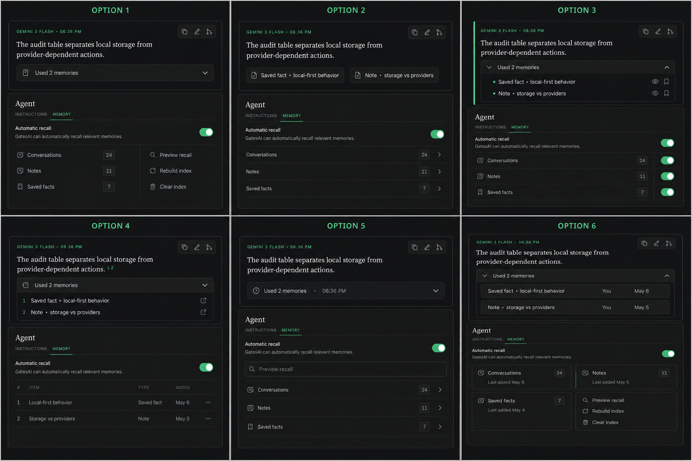

# Semantic-memory UI decision round

Generated 2026-07-19 from the current GatesAI chat and Agent-page screenshots.
The six options preserve the three-tab information architecture and compare two
linked surfaces: the disclosure under a response and the Agent → Memory manager.

## Options

1. Quiet one-line disclosure; compact split manager.
2. Source chips; terse navigable source rows.
3. Evidence rail; inline per-source toggles.
4. Footnote references; table-like manager.
5. Timestamped activity row; preview-first manager.
6. Compact provenance rows; grouped status/action cards.

The implementation is intentionally paused at the visual boundary until Ethan
selects an option or combines named parts. Record the decision in
`SELECTION.md`; do not infer it from this prompt.
