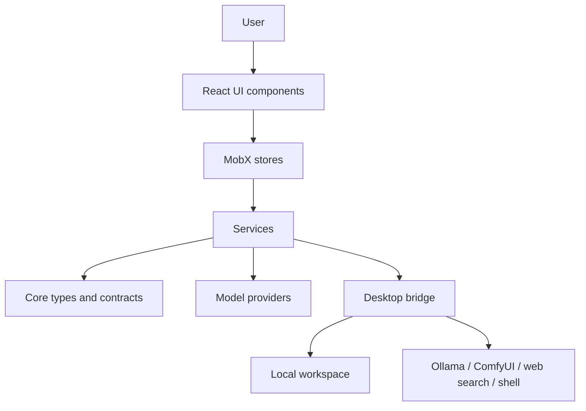
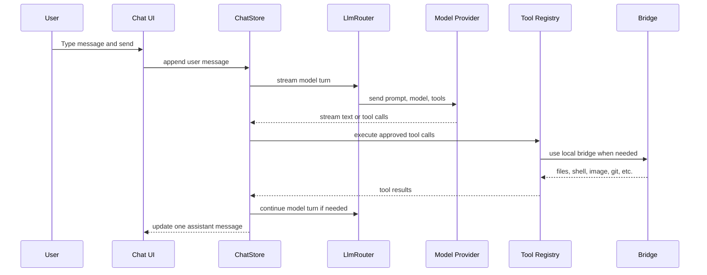

# Codebase Tour

This is the codebase explained in simple blocks. The real code has details, but
most behavior flows through the same shape.

## Big picture



Simple version:

- Components show the app.
- Stores remember app state.
- Services do work.
- Core defines shared types and contracts.
- Providers talk to AI models.
- The bridge talks to the local computer.
- The workspace is the folder the assistant is allowed to use.

## Main folders

```txt
src/
  app/          The top-level app shell.
  components/   UI pieces: chat, menu, image previews, shared controls.
  stores/       Long-lived app state.
  services/     Work units: LLMs, tools, bridge, storage, image jobs.
  core/         Shared types, model metadata, runtime and capability concepts.
  styles/       CSS layers for the editorial interface and controls.
tests/          Unit and e2e tests.
docs/           Product, architecture, plans, audits, and setup docs.
src-tauri/      Desktop wrapper, security config, and bundle setup.
```

## The "singleton" idea in this app

The app has one main `RootStore` instance for the running UI. It is not a
global magic object; it is the composed app state tree.

Think of it like a control board:

```txt
RootStore
  ChatStore
  ProviderStore
  BridgeStore
  ImageJobStore
  LocalRuntimeStore
  ModelRegistry
  SearchStore
  UiStore
  ...
```

Each store owns one area of state. The UI reads from stores. Services are called
when something needs to happen outside plain state changes.

The refactor direction is to keep this control board, but make each dial easier
to understand and make the chat turn logic less crowded.

## Chat turn flow

When the user sends a message:



Important rule:

The chat should feel like one coherent assistant turn. Tool details can be shown
inline, but random extra assistant messages should not appear just because a
background job finished.

## Important blocks

### UI block

Primary files:

- `src/app/App.tsx`
- `src/components/editorial/*`
- `src/components/menu/*`
- `src/components/media/*`
- `src/components/ui/*`

The UI should stay mostly presentational. It should ask stores for state and
call store actions. It should not know how to talk to OpenRouter, Ollama,
ComfyUI, or the bridge directly.

### Store block

Primary files:

- `src/stores/RootStore.ts`
- `src/stores/ChatStore.ts`
- `src/stores/ProviderStore.ts`
- `src/stores/BridgeStore.ts`
- `src/stores/ImageJobStore.ts`
- `src/stores/LocalRuntimeStore.ts`

Stores are the app's memory while it is running. They should expose clear
actions like "send message", "select model", "start image job", and "update
thread settings."

Refactor direction:

- Keep stores as state owners.
- Move heavy workflows out into focused services or engines.
- Add explicit `boot()` and `dispose()` lifecycle so startup and cleanup are
  understandable.

### Service block

Primary files:

- `src/services/llm/*`
- `src/services/tools/*`
- `src/services/bridge/*`
- `src/services/image/*`
- `src/services/storage/*`
- `src/services/diagnostics/*`

Services are where work happens. A service can call an API, format a tool
result, persist data, load an image, or talk to the bridge.

Good service shape:

```ts
export async function doSpecificThing(input: Input): Promise<Result> {
  // Validate input.
  // Call the boundary.
  // Return a typed result.
}
```

The service should not secretly own UI state. Stores own state; services do
work and return results.

### Core block

Primary files:

- `src/core/types.ts`
- `src/core/models/*`
- `src/core/providers.ts`
- `src/core/runtime/*`
- `src/core/tools/*`

Core is where shared language lives. If many parts of the app need the same
type, enum, model metadata, or capability definition, it belongs here.

### Bridge block

The desktop bridge is the local-power boundary. The app asks the bridge to do
things that a browser cannot safely do:

- Read and write workspace files.
- Run allowlisted shell commands.
- Use git.
- Save artifacts.
- Reach local runtimes.

Web Lite does not have the same bridge powers, so bridge-dependent features
must be capability-gated.

### Capability block

Capabilities answer:

```txt
Can this runtime do this thing right now?
```

Examples:

- Can use OpenRouter chat.
- Can use Ollama chat.
- Can generate images through OpenRouter.
- Can generate images through ComfyUI.
- Can read workspace files.
- Can run terminal commands.
- Can search the web.

The LEGO refactor should make capabilities the source of truth for:

- Tool exposure to the model.
- Model picker visibility.
- Setup cards and unavailable messages.
- Web Lite limitations.
- Desktop runtime status.

## LEGO direction

The goal is not to rewrite everything. The goal is to make the blocks clearer.

```txt
Capability Manifest
  tells the app what is available

ChatTurnEngine
  coordinates one user turn

Tool Registry
  exposes only tools that are available and safe

Provider Adapters
  translate GatesAI requests to OpenRouter or Ollama

Image Job System
  owns queued image generation and card updates

Artifact System
  owns generated files and previews

Workspace System
  owns local files and git
```

The biggest cleanup target is `ChatStore`: keep it as the state owner, but move
the detailed turn orchestration into a `ChatTurnEngine` after reliability bugs
are fixed.
